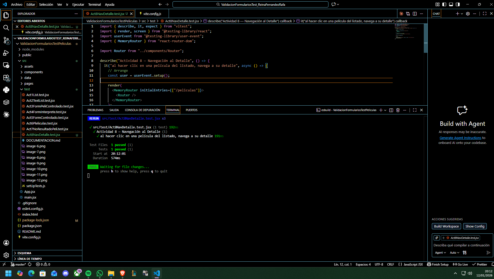

Documentación hecha para la actividad de Test en Películas - Rafael Reina Ferrández

## Actividad 1

Reto:
Comprueba que el componente List muestra correctamente el nombre pasado por props y que, si la película tiene una nota de 10, el título aparece en color rojo (clase text-red-600).

Prompt IA:
Actúa como profesor de testing en React. Quiero aprender a diseñar un test unitario con Vitest + React Testing Library para un componente List que recibe props y aplica una clase CSS condicional.
Explícame cómo identificar en el JSX qué parte cambia según esNota10 y qué selector accesible debo usar para localizar el título.
Dame un esqueleto de test siguiendo AAA (Arrange/Act/Assert) y dime qué debo comprobar en cada fase.

Explicación de los test:

Arrange:
Renderizo el componente <List /> pasando props (foto, nombre, esNota10) y un texto por children. Hago 3 casos:
-renderiza el nombre,
-si esNota10=true el título va en rojo,
-si esNota10=false el título NO va en rojo.

Act:
-Localizo el título usando un selector accesible: screen.getByRole("heading", { name: /.../i })
-No hay interacción del usuario en esta actividad.

Assert:
-Compruebo que el título existe en el DOM (toBeInTheDocument).
-Compruebo que tiene la clase text-red-600 cuando esNota10 es true.
-Compruebo que no tiene text-red-600 cuando esNota10 es false (con .not.toHaveClass(...)).

## Actividad 2

Reto:
Verifica que el componente List renderiza correctamente el contenido que se le pasa a través de children (recuerda que se usa para la clasificación o biografía) y comprueba que la imagen tiene el atributo alt correcto basado en el nombre del intérprete o de la película.

Prompt IA:
Actúa como profesor de testing en React. Quiero aprender a diseñar un test con Vitest + React Testing Library para comprobar:
-que un componente renderiza correctamente el contenido pasado por children, y
-que una imagen tiene un alt accesible generado dinámicamente con una prop (nombre).
Explícame qué debo mirar en el JSX para saber dónde se renderiza children (si aparece una o varias veces) y qué selector accesible es mejor en cada caso (getByText, getAllByText, getByAltText o getByRole('img')).
Dame un esqueleto de test siguiendo AAA (Arrange/Act/Assert) y explica por qué elegir getAllByText cuando el texto puede aparecer duplicado.

Explicación del test:

Arrange:
-Renderizo <List /> pasando foto, nombre y un texto por children.

Act:
-Para children, busco el texto pasado usando screen.getAllByText(texto) (porque en el componente children se renderiza en más de un lugar).
-Para la imagen, localizo el  con screen.getByAltText(\Foto de ${nombre}`)`.

Assert:
-Compruebo que el contenido children aparece en el documento (al menos una vez).
-Compruebo que la imagen existe y su alt coincide exactamente con el formato Foto de ${nombre}.

## Actividad 3

Reto:
En FormularioPeliculaControlado.jsx, verifica que, si el usuario intenta enviar el formulario con el nombre vacío, aparece el mensaje "El nombre es obligatorio"

## Actividad 4

## Actividad 5

## Actividad 6

## Actividad 7

## Actividad 8

## Actividad 9

## Actividad 10
