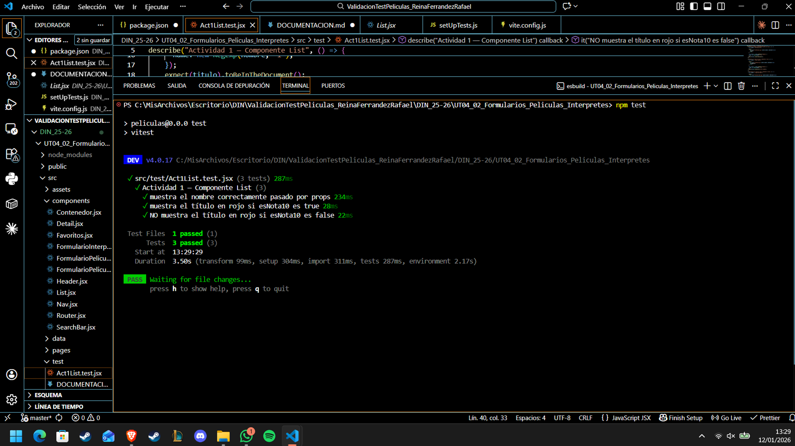
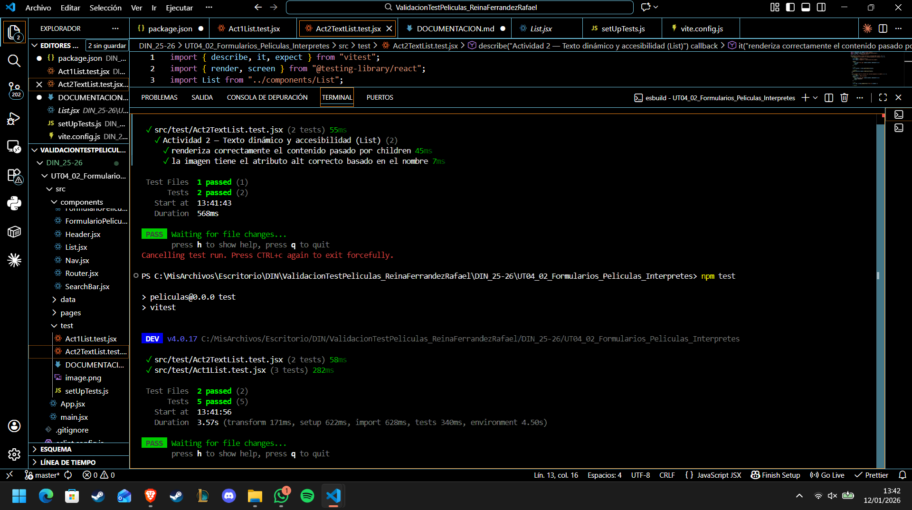
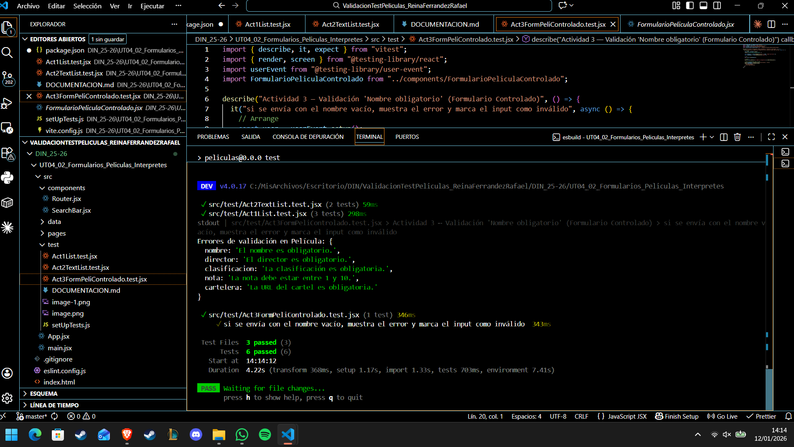
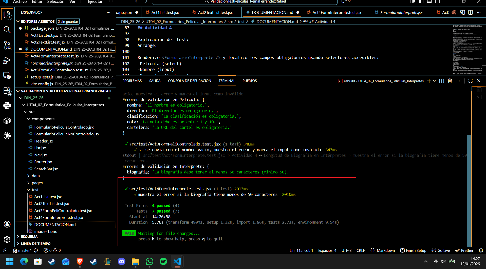
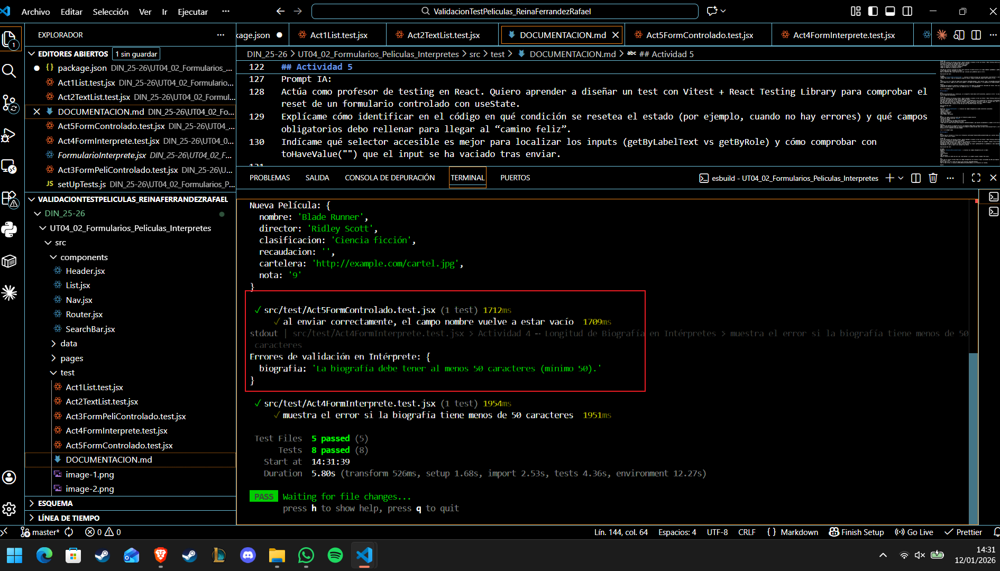
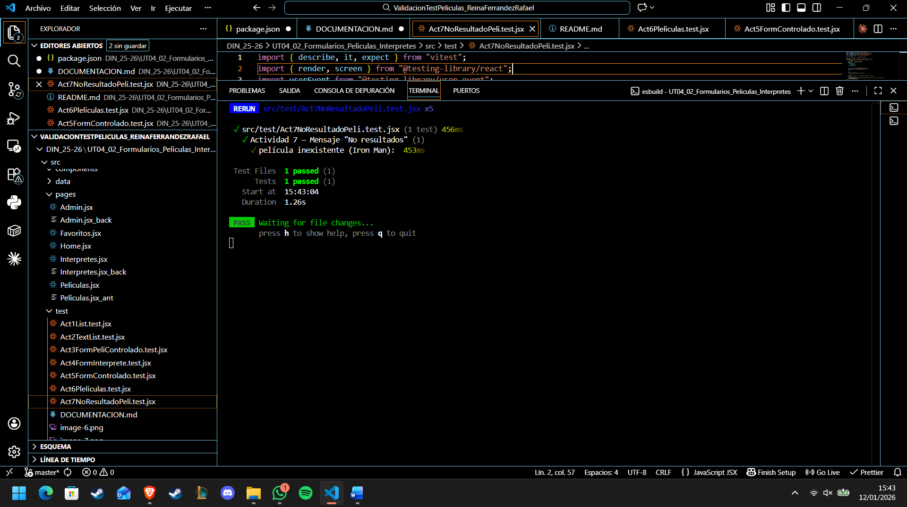

Documentación hecha para la actividad de Test en Películas - Rafael Reina Ferrández

## Actividad 1

Reto:
Comprueba que el componente List muestra correctamente el nombre pasado por props y que, si la película tiene una nota de 10, el título aparece en color rojo (clase text-red-600).

Prompt IA:
Actúa como profesor de testing en React. Quiero aprender a diseñar un test unitario con Vitest + React Testing Library para un componente List que recibe props y aplica una clase CSS condicional.
Explícame cómo identificar en el JSX qué parte cambia según esNota10 y qué selector accesible debo usar para localizar el título.
Dame un esqueleto de test siguiendo AAA (Arrange/Act/Assert) y dime qué debo comprobar en cada fase.

Explicación de los test:

Arrange:
Renderizo el componente <List /> pasando props (foto, nombre, esNota10) y un texto por children. Hago 3 casos:
-renderiza el nombre,
-si esNota10=true el título va en rojo,
-si esNota10=false el título NO va en rojo.

Act:
-Localizo el título usando un selector accesible: screen.getByRole("heading", { name: /.../i })
-No hay interacción del usuario en esta actividad.

Assert:
-Compruebo que el título existe en el DOM (toBeInTheDocument).
-Compruebo que tiene la clase text-red-600 cuando esNota10 es true.
-Compruebo que no tiene text-red-600 cuando esNota10 es false (con .not.toHaveClass(...)).

## Actividad 2

Reto:
Verifica que el componente List renderiza correctamente el contenido que se le pasa a través de children (recuerda que se usa para la clasificación o biografía) y comprueba que la imagen tiene el atributo alt correcto basado en el nombre del intérprete o de la película.

Prompt IA:
Actúa como profesor de testing en React. Quiero aprender a diseñar un test con Vitest + React Testing Library para comprobar:
-que un componente renderiza correctamente el contenido pasado por children, y
-que una imagen tiene un alt accesible generado dinámicamente con una prop (nombre).
Explícame qué debo mirar en el JSX para saber dónde se renderiza children (si aparece una o varias veces) y qué selector accesible es mejor en cada caso (getByText, getAllByText, getByAltText o getByRole('img')).
Dame un esqueleto de test siguiendo AAA (Arrange/Act/Assert) y explica por qué elegir getAllByText cuando el texto puede aparecer duplicado.

Explicación del test:

Arrange:
-Renderizo <List /> pasando foto, nombre y un texto por children.

Act:
-Para children, busco el texto pasado usando screen.getAllByText(texto) (porque en el componente children se renderiza en más de un lugar).
-Para la imagen, localizo el  con screen.getByAltText(\Foto de ${nombre}`)`.

Assert:
-Compruebo que el contenido children aparece en el documento (al menos una vez).
-Compruebo que la imagen existe y su alt coincide exactamente con el formato Foto de ${nombre}.

## Actividad 3

Reto:
En FormularioPeliculaControlado.jsx, verifica que, si el usuario intenta enviar el formulario con el nombre vacío, aparece el mensaje "El nombre es obligatorio"

Propmt IA:
Actúa como profesor de testing en React. Quiero aprender a diseñar un test con Vitest + React Testing Library para un formulario controlado con useState que valida al enviar.
Explícame qué partes del JSX debo revisar para saber:
-si es un formulario controlado (value + onChange),
-dónde se ejecuta la validación (onSubmit),
-dónde se renderiza el mensaje de error.

Indícame qué selector accesible es mejor para localizar el botón de envío y el campo “Nombre” (getByRole / getByLabelText) y cuándo tengo que usar userEvent con await.
Dame un esqueleto AAA y explícame por qué aquí conviene usar getByText para el error.

Explicación del test:

Arrange:
-Renderizo <FormularioPeliculaControlado />. Localizo el botón de enviar por accesibilidad (role="button") y nombre visible (“Añadir Película”). Como la validación sucede al enviar, preparo userEvent.setup() para simular el clic.

Act:
-Simulo el clic en el botón de submit para disparar handleMovieSubmit. Esta función llama a validateMovie(movieData) y, al estar nombre vacío, añade el error errors.nombre = "El nombre es obligatorio." y lo guarda en el estado movieErrors.

Assert:
-Compruebo que aparece en pantalla el mensaje de error “El nombre es obligatorio” (buscando por texto). Esto confirma que la validación se ejecutó y que el error se renderizó en el 
 correspondiente.

## Actividad 4

Reto:
En FormularioInterprete.jsx, valida que, si la biografía tiene menos de 50 caracteres, aparece el error: "La biografía debe tener al menos 50 caracteres".

Prompt IA:
Actúa como profesor de testing en React. Quiero aprender a diseñar un test con Vitest + React Testing Library para un formulario controlado que valida varios campos al enviar.
Explícame cómo identificar en el código qué campos son obligatorios y qué validaciones se ejecutan en handleSubmit.
Indícame cómo seleccionar el textarea de biografía usando un selector accesible y por qué, en este caso, para llegar al error de biografía necesito rellenar también los otros campos obligatorios (película, nombre e imagen).
Dame un esqueleto AAA y explica cuándo hay que usar userEvent.setup() con await.

Explicación del test:

Arrange:
Renderizo <FormularioInterprete /> y localizo los campos obligatorios usando selectores accesibles:
-Película (select)
-Nombre (input)
-Biografía (textarea)
-URL Imagen (input)
-Botón Añadir Intérprete

Act:
Relleno los campos necesarios para que el formulario pueda enviarse:
-Selecciono una película del <select>
-Escribo un nombre
-Escribo una biografía con menos de 50 caracteres
-Escribo una URL válida que empiece por http
-Luego pulso el botón de enviar para disparar handleActorSubmit, que ejecuta validateActor y añade el error de biografía.

Assert:
Compruebo que aparece el mensaje de error “La biografía debe tener al menos 50 caracteres”.
Además, verifico accesibilidad: el textarea de biografía queda marcado como inválido (aria-invalid="true") y referencia su mensaje de error mediante aria-describedby.

## Actividad 5

Reto:
Verifica que al rellenar el título en el formulario controlado FormularioPeliculaControlado.jsx y pulsar enviar, el campo vuelve a estar vacío (reset).

Prompt IA:
Actúa como profesor de testing en React. Quiero aprender a diseñar un test con Vitest + React Testing Library para comprobar el reset de un formulario controlado con useState.
Explícame cómo identificar en el código en qué condición se resetea el estado (por ejemplo, cuando no hay errores) y qué campos obligatorios debo rellenar para llegar al “camino feliz”.
Indícame qué selector accesible es mejor para localizar los inputs (getByLabelText vs getByRole) y cómo comprobar con toHaveValue("") que el input se ha vaciado tras enviar.

Explicación del test:

Arrange:
Renderizo <FormularioPeliculaControlado /> y localizo los campos obligatorios por su label:
-Nombre
-Director
-Clasificación
-Nota
-URL Cartelera
También localizo el botón de envío por role="button" y su nombre visible (“Añadir Película”).

Act:
Simulo que el usuario rellena todos los campos obligatorios con valores válidos (incluyendo una URL que empiece por http y una nota entre 1 y 10).
Después hago clic en el botón de enviar para ejecutar handleMovieSubmit.
Como no hay errores, se ejecuta setMovieData(initialMovieData) y el formulario se resetea.

Assert:
Verifico que el campo Nombre vuelve a estar vacío tras el envío, comprobando que su valor es "" con toHaveValue("").
Esto confirma que el estado del formulario se ha reiniciado correctamente.

## Actividad 6

Reto:
Comprueba que el buscador en Peliculas.jsx funciona, aunque el usuario escriba en minúsculas (ej: "sexto" para encontrar "El sexto sentido").

Prompt IA:
Actúa como profesor de testing en React. Quiero aprender a diseñar un test de integración con Vitest + React Testing Library para un listado que se filtra al escribir en un buscador.
Explícame qué debo revisar en Peliculas.jsx para saber si necesito envolver el componente con MemoryRouter (por ejemplo, por el uso de Link).
Indícame cómo localizar el input del buscador usando un selector accesible (getByRole con name, getByLabelText o getByPlaceholderText) y qué debo mirar en SearchBar.jsx para decidir cuál usar.
Dame un esqueleto AAA y explícame por qué aquí es buena idea comprobar que aparece un título concreto tras filtrar.

Explicación del test:

Arrange:
Renderizo <Peliculas /> dentro de MemoryRouter porque el listado usa <Link> (React Router) y, sin router, el render podría fallar.
Localizo el input del buscador con un selector accesible, usando el texto del placeholder/aria-label: "Buscar películas por nombre...".

Act:
Simulo que el usuario escribe "sexto" (minúsculas) en el input usando userEvent.type(...).
Esto actualiza searchTerm y la lista filtrada (useMemo + toLowerCase + includes).

Assert:
Compruebo que aparece en pantalla "El sexto sentido" tras escribir en el buscador.
Esto valida que el filtro es case-insensitive.

## Actividad 7

Reto:
Verifica que si buscas una película que no existe (ej: "Iron Man"), aparece el mensaje: "No se encontraron películas con el término Iron Man".

Prompt IA:
Actúa como profesor de testing en React. Quiero aprender a diseñar un test de integración con Vitest + React Testing Library para comprobar el estado “sin resultados” de un listado filtrado.
Explícame cómo identificar en el componente Peliculas.jsx el mensaje que se renderiza cuando el array filtrado está vacío.
Indícame qué selector accesible es más adecuado para comprobar la aparición de un mensaje informativo (getByText vs queryByText) y por qué.
Dame un esqueleto AAA (Arrange / Act / Assert) y explica por qué es importante comprobar también el texto dinámico que incluye el término de búsqueda.

Explicación del test:

Arrange:
Renderizo el componente <Peliculas /> envuelto en MemoryRouter, ya que el listado utiliza <Link> de React Router.
Localizo el input del buscador usando un selector accesible (getByRole("textbox")) basado en el nombre/placeholder del campo de búsqueda.

Act:
Simulo que el usuario escribe “Iron Man” en el buscador mediante userEvent.type(...).
Esto actualiza el estado searchTerm y provoca que el array filteredPeliculas quede vacío.

Assert:
Compruebo que aparece en pantalla el mensaje informativo: “No se encontraron películas con el término Iron Man.”
Esto confirma que la aplicación gestiona correctamente el caso en el que no hay coincidencias y muestra feedback claro al usuario.

## Actividad 8

## Actividad 9

## Actividad 10
